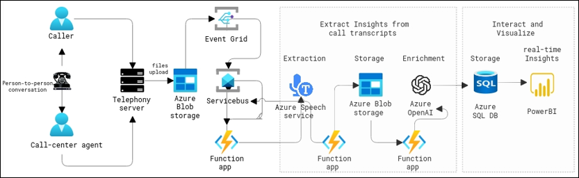

# Call Center data analysis using Azure AI services and Azure OpenAI 

## Background:
You are a technology consultant working with a leading call center that is determined to enhance its customer service and operational efficiency. The call center handles a diverse range of customer inquiries, feedback, and support issues on a daily basis. The management has decided to leverage advanced technologies to extract valuable insights from customer conversations and improve overall performance.

## Objectives:
The main objectives of this hands-on lab are to implement real-time and post-call analytics using Azure AI services and Azure OpenAI Service. The goal is to gain actionable insights, understand customer sentiment, and optimize call center operations. This immersive experience will guide you through a diverse range of topics related to data processing, audio transcription, sentiment analysis, and data visualization, allowing you to master real-time and post-call analytics.

## Architecture diagram

 

## Lab Overview

In this Hands-on-lab, you will perform the following tasks.

+ Task 1: Provision Azure resources.
+ Task 2: Upload audio files.
+ Task 3: Visualization using PowerBI Report and Dashboard.

## Dataflow

* **Phone Call Recording**:
   Customer-agent conversations are recorded and stored in Azure Blob Storage.

* **Audio Transcription**:
    Azure AI Speech transforms raw audio into text, providing a foundation for analysis.

* **Sentiment Analysis**:
    Leveraging Azure OpenAI, sentiment analysis categorizes interactions as positive, negative, or neutral, offering a holistic view of customer sentiment.

* **Real-Time Analytics**:
    Integrating Azure AI services into the call center infrastructure enables instantaneous analysis of live customer calls, offering immediate insights to customer service representatives.

* **Data Visualization**:
    Utilize Power BI, a powerful SaaS tool, to craft interactive dashboards. Visualize customer sentiment trends, call volumes, and key metrics, empowering management to make informed decisions.

## Expected Outcomes:

* **Enhanced Customer Satisfaction**:
     Address issues in real-time and understand long-term trends.

* **Improved Operational Efficiency**:
     Insights gained from both real-time and post-call analytics enhance overall efficiency.

* **Empowered Customer Service Representatives**:
     Equip customer service representatives with tools to better understand and respond to customer needs.

* **Data-Driven Decision-Making**:
     Call center management benefits from data-driven decision-making, leading to strategic improvements in service delivery.

Seize the opportunity to blend technology and strategy, unlocking the potential of AI in a call center environment
