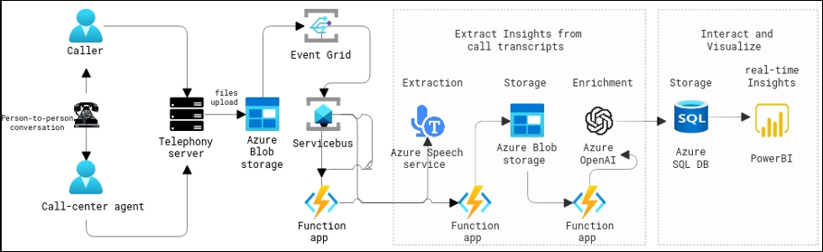

# Call Center data analysis using Azure AI services and Azure OpenAI 

## Background:
You are a technology consultant working with a leading call center that is determined to enhance its customer service and operational efficiency. The call center handles a diverse range of customer inquiries, feedback, and support issues on a daily basis. The management has decided to leverage advanced technologies to extract valuable insights from customer conversations and improve overall performance.

## Objectives:
The main objectives of this hands-on lab are to implement real-time and post-call analytics using Azure AI services and Azure OpenAI Service. The goal is to gain actionable insights, understand customer sentiment, and optimize call center operations. This immersive experience will guide you through a diverse range of topics related to data processing, audio transcription, sentiment analysis, and data visualization, allowing you to master real-time and post-call analytics.

## Architecture diagram

 

## Dataflow

* When a audio file lands in the **audio-input** container in the **storage account** , an **Event Grid** event signals the completion of the file upload. The file is then filtered and pushed to a **Service Bus** queue. The code within the first Azure Function, **StartTranscriptionFunction** is triggered by a timer, picking up the event and initiating a transmission request using the **Azure Speech Services** batch pipeline. After the transmission request is complete, an event is placed in another queue within the same Service Bus resource. Subsequently, the second Azure Function, **FetchTranscriptionFunction**, is triggered by the completion event, begins monitoring the transcription completion status. Upon transcription completion, this Azure Function copies the transcript into the **json-result-output** container in the storage account.

* Next, using the code of third Azure Function, **AnalyzeTranscriptionFunction** the JSON file(transcript) from the **json-result-output** container is further analyzed using **Azure OpenAI** resource and the **Conversation summary** , **sentiment analysis** whether it is **Positive or Negative** is further loaded to a **SQL Database** which will be used for Visualization in **PowerBI**

## Expected Outcomes:

* **Enhanced Customer Satisfaction**:
     Address issues in real-time and understand long-term trends.

* **Improved Operational Efficiency**:
     Insights gained from both real-time and post-call analytics enhance overall efficiency.

* **Empowered Customer Service Representatives**:
     Equip customer service representatives with tools to better understand and respond to customer needs.

* **Data-Driven Decision-Making**:
     Call center management benefits from data-driven decision-making, leading to strategic improvements in service delivery.

## Lab Overview

In this Hands-on-lab, you will perform the following tasks.

+ Task 1: Provision Azure resources.
+ Task 2: Upload audio files.
+ Task 3: Visualization using PowerBI Report and Dashboard.

Seize the opportunity to blend technology and strategy, unlocking the potential of AI in a call center environment
