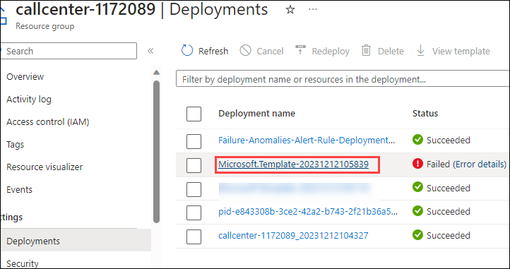

## Task 1: Provision Azure resources

In this task, you will deploy an ARM Template to provision the necessary resources for the lab, facilitating the seamless processing of audio files for transcription, sentiment analysis, and conversation summary.

   * **Storage Account**: Used for uploading audio files and storing transcribed files.

   * **Service Bus**: Manages queues and sets up authorization rules for the function apps.

   * **Event Grid**: Creates an event subscription (BlobCreatedEvent) associated with the storage account. This triggers when a blob is created under specific conditions and pushes the event to the Service Bus queue.

   * **Key Vault**: Stores secrets such as keys and connection string values securely.

   * **Speech Service**: Utilized for transcribing audio files (Speech to Text).

   * **OpenAI Service**: To summarize the conversation and also to perform sentiment analysis.

   * **StartTranscription Function App**: Contains code triggered by a timer, initiating a transcription request using Azure Speech Services batch pipeline. Upon completion, an event is placed in another queue within the same Service Bus resource.

   * **FetchTranscription Function App**: Code triggered by the completion event monitors transcription completion status. When complete, the Azure Function copies the transcript into the json-result-output container.

   * **AnalyzeTranscription Function App**: Code triggered when a blob (JSON file transcript) is added to the json-result-output container. It further analyzes using Azure OpenAI resources, extracting conversation summaries and performing sentiment analysis (Positive or Negative). The results are then loaded into a SQL Database for visualization purposes.
     
   * **SQL Database**: Used for storing the data which will be used for Visualization. 

1. In the **Azure portal**, search for **deploy** and select **Deploy a custom template** from the services list.

   

1. On the **Custom deployment** blade, select **Build your own template in the editor** 

   

1. On the **Edit template** blade, click on **Load file** and navigate to the **C:\LabFiles** and upload the file **azuredeploy-01.json**.

   

   

1. Click on **Save**

1. On the **Custom deployment** blade, select the resource group name **callcenter-<inject key="Deployment-id" enableCopy="false"></inject>** from the dropdown.

    

1. Scroll down and replace the existing **EnterUniqueID** text value with **<inject key="Deployment-id" enableCopy="false"></inject>** for the Deployment Id Parameter, and leave all other default values and click on **Review + create**

    

1. Click on **Create**

   
   
1. Wait for deployment to be completed.It might take around 6-7 mins.

## Deployment Failure Handling:

In case of a deployment failure, especially due to database provision errors or other resource provision issues, follow these steps to rectify the situation.

* **Navigate to the Resource Group**:

   * Access the **callcenter-<inject key="Deployment-id" enableCopy="false"></inject>** resource group from the deployment blade.

   

* **Delete the Database Resource**:

   * Scroll down to the resources and select the **Database-<inject key="Deployment-id" enableCopy="false"></inject>** and click on **Delete** to remove the database resource.

   

* **Confirm Deletion**:

   * On the **Delete Resources** blade, confirm deletion by entering **delete** in the text box and click on **Delete** to proceed.

   
  
* **Navigate to Failed Deployment Overview**:

   * Under the resource group, select Deployments under settings and click on the deployment with a failed status to navigate to the overview of the failed deployment.
  
   
  
   

* **Initiate Redeployment**:

   * Select **Redeploy** and follow steps 6 and 7 again and Wait for the deployment to succeed.
     
   

### End of Task-1

## Proceed to Next Task
